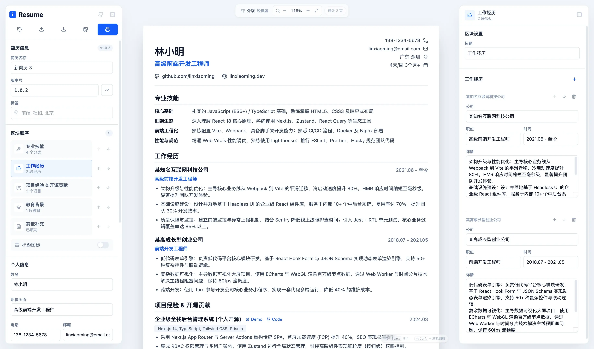

<div align="center">
  
#  iResume

**在线简历工作台 · 轻量优雅多主题**

[立即体验](https://resume.dogxi.me) · [报告问题](https://github.com/dogxii/iresume/issues) · [功能建议](https://github.com/dogxii/iresume/issues)


</div>

---

## 👀 预览

https://resume.dogxi.me



(截图为经典蓝主题，另有 13+ 主题)

## 📚 简介

iResume 是一款本地优先的在线简历生成器。它把简历库、结构化编辑、实时预览、主题微调、分页检查和导出能力放在一个轻量工作台里，适合快速维护多份投递版本。

**核心理念：** 少一点配置感，多一点交付感。默认样式保持克制专业，需要时再通过主题、字号、页边距和区块显示偏好做细节调整。

## ⚡️ 功能特性

- 简历库：管理多份简历，支持命名、标签、版本号、复制和更新时间
- 工作台：左右分区编辑，实时预览，支持缩放、拖动画布和点击区块定位编辑
- 外观设置：内置多套主题，可调整字号、页边距、标题图标和区块显示偏好
- 导出投递：支持 PDF 打印优化、PNG 图片导出和分页预估
- 数据安全：默认保存在浏览器本地，可通过 GitHub OAuth 加密同步

## 🚀 快速开始

线上版本实时更新，打开即可使用：

https://resume.dogxi.me

## 本地运行

```bash
git clone https://github.com/dogxii/iresume.git
cd iresume
npm install
npm run dev
```

访问 [http://localhost:5173](http://localhost:5173)

## 构建

```bash
npm run build
npm run preview
```

## 🧭 使用提示

- 导出 PDF 时建议关闭浏览器页眉页脚，并开启背景图形
- 简历内容默认存储在 LocalStorage，换浏览器或清理缓存前可以先导出备份
- GitHub 云同步需要配置 `.env.example` 中的 OAuth 环境变量，callback URL 使用应用首页地址即可

## 技术栈

React 19 · TypeScript · Vite · Tailwind CSS 4 · Lucide React

## 📈 项目 Star 历史

[](https://www.star-history.com/#dogxii/iresume&Date)

## 💰 赞赏项目

如果觉得这个项目对你有帮助，欢迎请我喝咖啡 ☕️

> 采取自愿原则, 收到的赞赏将用于提高开发者积极性和开发环境。

<div style="display:flex; gap:24px; align-items:center;">
  
  
</div>

## 🪪 License

[MIT](LICENSE) © 2026 Dogxi
